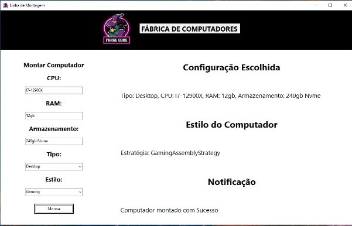

# Fourge Core - Fábrica de Computadores

Fourge Core é um sistema de montagem de computadores desenvolvido em C# com interface gráfica (Windows Forms). O projeto foi criado como parte de um seminário acadêmico com o objetivo de aplicar cinco padrões de projeto (Design Patterns) na construção de uma plataforma intuitiva e funcional. 

O usuário pode montar um computador escolhendo:
- **Processador (CPU)**
- **Memória RAM**
- **Armazenamento**
- **Tipo** (Desktop ou Notebook)
- **Estilo** (Gaming ou Trabalho)

Após selecionar as opções, o sistema exibe a configuração final, simulando a montagem de um PC sob demanda.


---

## 🚀 Funcionalidades
- **Montagem personalizada de computadores.**
- **Escolha de componentes principais** (CPU, RAM, Armazenamento).
- **Definição do tipo de dispositivo** (Desktop ou Notebook).
- **Aplicação de estilos** como "Gaming" ou "Trabalho".
- **Visualização da configuração final montada.**

---

## 🛠 Padrões de Projeto Utilizados

O projeto aplica cinco padrões de design diferentes para garantir flexibilidade, expansibilidade e boas práticas de desenvolvimento:

- **Builder** - Constrói as peças e a configuração do PC de forma modular.
- **Factory Method** - Permite a criação de diferentes tipos de computadores (Desktop ou Notebook).
- **Strategy** - Define diferentes estratégias de montagem baseadas no estilo escolhido (Gaming ou Trabalho).
- **Observer** - Notifica quando uma nova montagem é concluída.
- **Singleton** - Garante que haja uma única instância do gerenciador de montagem.

---

## 🖥 Tecnologias Utilizadas

- **C#** - Linguagem principal para a lógica do sistema.
- **Windows Forms** - Desenvolvimento da interface gráfica (GUI).
- **Visual Studio** - Ambiente de desenvolvimento utilizado.

---

## 📷 Imagens do Projeto


---



---

## 📥 Como Rodar o Projeto Localmente

1. **Clone o repositório:**
```bash
git clone https://github.com/marcosguisleri/Fourge-Core.git
```

2. **Abra o projeto no Visual Studio.**
3. **Compile o projeto.**
4. **Execute o arquivo .exe** gerado dentro da pasta **bin**.

---

## 📊 Diagramas e Interface

🔗 Diagrama: https://drive.google.com/file/d/1xFU23Tgi_1uK1WK3HWe5-Un2YwkrFW4j/view?usp=sharing

- O projeto inclui **diagramas de classes** que descrevem a arquitetura e a implementação dos padrões de projeto.
- A interface é simples e intuitiva, permitindo uma experiência fluida para o usuário final.

---

## 📅 Licença
Este projeto é de uso acadêmico e não possui licença específica para redistribuição. Para usos comerciais, consulte o desenvolvedor.

Desenvolvido por **Marcos Guisleri**.

